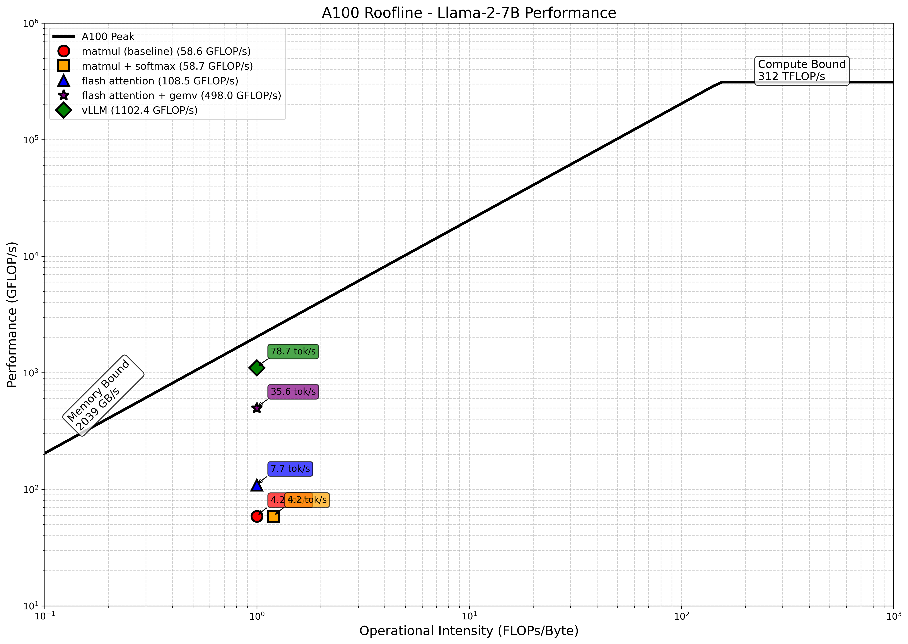

# Project 5: Flash Attention

This project implements three CUDA kernels for LLaMA2 inference: a softmax kernel, a FlashAttention V1 kernel, and FlashAttention + GEMV. Performance is tested against vLLM on A100 GPU.

## Files

- `llama2-matmul.cu`: CUDA matrix multiplication kernel implementation
- `llama2-matmul-softmax.cu`: CUDA matmul + softmax kernel implementation  
- `llama2-flashattention.cu`: FlashAttention V1 CUDA kernel implementation
- `llama2-flashattention-gemv.cu`: FlashAttention + optimized GEMV kernel implementation
- `run_benchmarks.py`: Modal cloud benchmarking script
- `plot_roofline.py`: Roofline chart generation script
- `roofline_chart.png`: Performance roofline analysis chart
- `all_benchmark_results.json`: Benchmark results and performance metrics

## Quick Start

### Change to Subdirectory

```bash
cd 05-fast-attention
```

### Benchmarking

1. **Run all benchmarks on Modal:**

   ```bash
   modal run run_benchmarks.py
   ```

### Generate a roofline chart

1. **Setup virtual environment:**

   ```bash
   python -m venv venv
   source venv/bin/activate
   pip install -r requirements.txt
   ```

2. **Generate roofline chart:**

   ```bash
   python plot_roofline.py
   ```

## Performance Results

### Speed Improvements

Based on benchmark results on A100 GPU:

- **llama2-matmul-softmax.cu** vs **llama2-matmul.cu**: `1.00`× faster (4.19 vs 4.18 tok/s)
- **llama2-flashattention.cu** vs **llama2-matmul-softmax.cu**: `1.85`× faster (7.75 vs 4.19 tok/s)
- **llama2-flashattention-gemv.cu** vs **llama2-flashattention.cu**: `4.59`× faster (35.57 vs 7.75 tok/s)
- **llama2-flashattention-gemv.cu** vs **vLLM**: `0.45`× of vLLM performance (35.57 vs 78.74 tok/s)

### Detailed Performance Metrics

| Implementation | Tokens/sec | Speedup vs Baseline |
|---|---|---|
| llama2-matmul.cu | 4.18 | 1.00× |
| llama2-matmul-softmax.cu | 4.19 | 1.00× |
| llama2-flashattention.cu | 7.75 | 1.85× |
| llama2-flashattention-gemv.cu | 35.57 | 8.51× |
| vLLM (reference) | 78.74 | 18.83× |

### Roofline Chart


